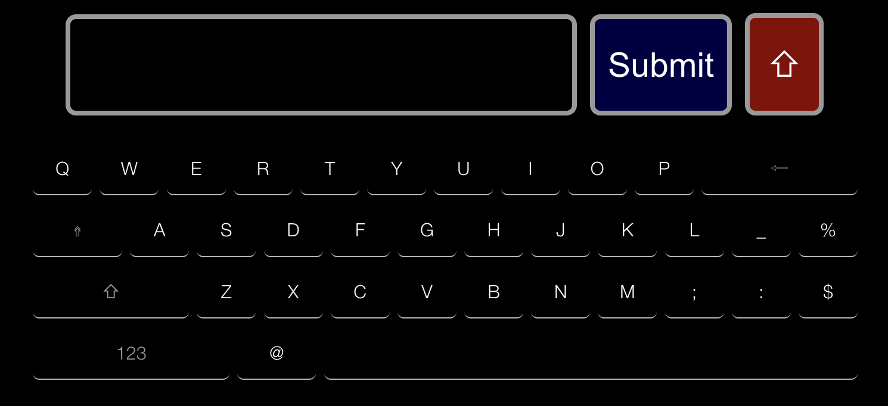

# MMM-Keyboard



A module for the [MagicMirror²](https://github.com/MichMich/MagicMirror/) that creates a virtual keyboard to be used to send commands or text to other modules.

This is a drop in replacement for the original [MMM-Keyboard](https://github.com/lavolp3/MMM-Keyboard) with some added configuration and functionality for module developers. It should work for all modules designed for the original as well.

## Features
 * Touch Support
 * Locale Support (en and de)

## Installing

### Step 1 - Install the module

```js
cd ~/MagicMirror/modules
git clone https://github.com/JHWelch/MMM-Keyboard.git
cd MMM-Keyboard
npm install
```

### Step 2 - Add module to `config.js`

Add this configuration into your `config.js` file

```js
{
    module: "MMM-Keyboard",
    position: "fullscreen_above",
    config: {
        startWithNumbers: false,
        startUppercase: true,
        debug: false
    }
}
```

## Dependencies

* [simple-keyboard](https://www.npmjs.com/package/simple-keyboard)

## Update

### Automatic Update

Did you know MagicMirror² has a built-in module updater? Read more about it [here](https://docs.magicmirror.builders/modules/updatenotification.html#updates-array).

Add the following to your `updates` array of `updatenotification` in `config/config.js`

```js
{ 'MMM-Keyboard': 'git pull && npm install --omit=dev' },
```

### Manual Update

In `~/MagicMirror/modules/MMM-Keyboard`

```sh
git pull
npm install --omit=dev
```

## Configuration options

| Option             | type                   | default         | Description                                                                                            |
| ------------------ | ---------------------- | --------------- | ------------------------------------------------------------------------------------------------------ |
| `language`         | string                 | config.language | The language. You can override the MM settings here.                                                   |
| `alwaysShow`       | boolean                | false           | Always show keyboard.                                                                                  |
| `startWithNumbers` | boolean                | false           | Start keyboard with 'numbers' layout                                                                   |
| `startUppercase`   | boolean                | true            | Always start with uppercase letters                                                                    |
| `debug`            | boolean                | false           | Debug mode for additional console output. Will also create a keyboard button to activate the keyboard. |
| `sendLabel`        | string                 | `'SEND!'`       | The label on the send button that will send the input back to the module.                              |
| `theme`            | `'default'\|'classic'` | `'default'`     | Keyboard theme to use. `'default'` is dark to match mirror, `'classic'` is the old repository theme.   |


# Working with the Keyboard

## Opening the keyboard

The keyboard works with MagicMirror's notification system. To launch the keyboard with the simplest arguments:

```js
this.sendNotification('KEYBOARD', {
    key: 'uniqueKey',
    style: 'default',
});
```

## Possible parameters

| Parameter   | Required | Description                                                                                                                          |
| ----------- | -------- | ------------------------------------------------------------------------------------------------------------------------------------ |
| `key`       | Yes      | Any unique identifier, ex. the module name. MMM-Keyboard will take the key and send it back for the module to understand it          |
| `style`     | Yes      | Required to keep consistency with classic. Options are `'default'` or `'numbers'`. Whether to start keyboard with letters or numbers |
| `data`      | No       | Optional extra data that will be returned along with the `key`                                                                       |
| `sendLabel` | No       | Override the label for the Send button                                                                                               |

```js
this.sendNotification('KEYBOARD', {
    key: 'MMM-YourModule',
    style: 'numbers',
    sendLabel: 'ADD',
    data: {
        sum: 10,
        foo: 'bar',
    },
});
```

## Receiving data

As soon as you hit the "SEND!"-Button the keyboard sends back the written content using the format

```js
this.sendNotification('KEYBOARD_INPUT', {
    key: 'uniqueKey',
    message: 'test',
    data: {
        sum: 10,
        foo: 'bar',
    }
});
```

The data object is the same you have send with your notification.  
You can fetch the message by checking for the `key` component. Here an example:

```js
notificationReceived : function (notification, payload) {
    if (notification == 'KEYBOARD_INPUT' && payload.key === 'uniqueKey') {
        console.log(payload.message);
    }
},
```

If additional data is passed with `data`, it will be returned as part of the payload

```js
notificationReceived : function (notification, payload) {
    if (notification == 'KEYBOARD_INPUT' && payload.key === 'uniqueKey') {
        const { sum, foo } = payload.data;
        // ...
    }
},
```

## THANKS

Thanks go to
- Francisco Hodge for his beautiful simple-keyboard npm module
- @jheyman for alpha testing :-)
- @lavolp3 for the original module
